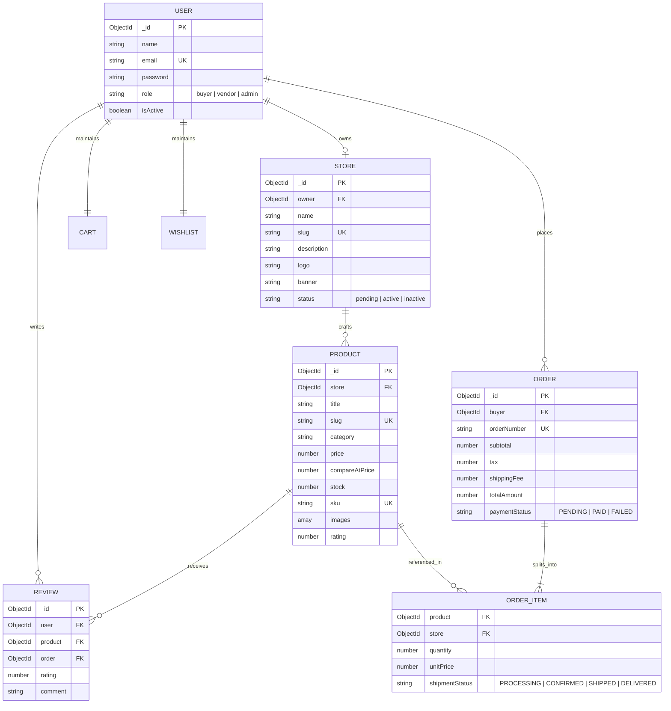

# 🏺 Artisan's Corner — Multi-Vendor E-Commerce Platform

[](https://artisan-corner-ten.vercel.app/)
[](https://artisan-corner-ten.vercel.app/)
[](https://artisan-corner-ten.vercel.app/)
[](https://artisan-corner-ten.vercel.app/)
[](https://artisan-corner-ten.vercel.app/)
[](https://opensource.org/licenses/MIT)

> **Artisan's Corner** is a production-ready, full-stack multi-vendor e-commerce marketplace platform engineered for independent potters, fine jewelers, woodcrafters, weavers, and leatherworkers. The platform bridges mindful shoppers and master craftspeople worldwide through dedicated digital storefronts, persistent multi-vendor shopping carts, automated Stripe split payments (5% dynamic platform fee + 95% net merchant payout), isolated order fulfillment pipelines, verified buyer reviews, and real-time sales analytics dashboards.

🌐 **Live Production Application**: [https://artisan-corner-ten.vercel.app/](https://artisan-corner-ten.vercel.app/)

---

## 📑 Table of Contents

- [🌟 Three-Sided Marketplace Ecosystem](#-three-sided-marketplace-ecosystem)
- [🔑 Verified Demo Credentials & Testing Accounts](#-verified-demo-credentials--testing-accounts)
- [✨ Key Features by User Experience](#-key-features-by-user-experience)
  - [🛍️ Buyer Shopping Surface](#️-buyer-shopping-surface)
  - [🏪 Artisan Merchant Suite](#-artisan-merchant-suite)
  - [🛡️ Platform Admin Governance](#️-platform-admin-governance)
- [🛠️ Full Technology Stack & Dependencies](#️-full-technology-stack--dependencies)
- [📁 Monorepo Project Structure](#-monorepo-project-structure)
- [🗄️ Database Architecture & ER Diagram](#️-database-architecture--er-diagram)
- [📡 RESTful API Reference](#-restful-api-reference)
- [🧭 Application Route Matrix](#-application-route-matrix)
- [🔒 Enterprise Security & Protection](#-enterprise-security--protection)
- [⚡ Local Development & Quick Start](#-local-development--quick-start)
- [🧪 Automated Integration Testing](#-automated-integration-testing)
- [🚀 Production Deployment Guide](#-production-deployment-guide)
- [📄 License](#-license)

---

## 🌟 Three-Sided Marketplace Ecosystem

Artisan's Corner is architected around a cohesive three-sided marketplace model:

```
                                  ┌──────────────────────────────┐
                                  │      Client (React 18)       │
                                  │   Vite · Tailwind · Redux    │
                                  └──────────────┬───────────────┘
                                                 │ HTTPS / JSON
                                                 ▼
                                  ┌──────────────────────────────┐
                                  │    Node.js / Express 5 API   │
                                  │   JWT HttpOnly · Rate-Limit  │
                                  └──────┬───────────────┬───────┘
                                         │               │
                 ┌───────────────────────┴──────┐ ┌──────┴────────────────────────┐
                 │       MongoDB Atlas          │ │      Third-Party Services      │
                 │ Mongoose ORM · Aggregations  │ │  Stripe SDK · Cloudinary CDN   │
                 └──────────────────────────────┘ └────────────────────────────────┘
```

1. **Shoppers / Mindful Buyers**: Discover curated craft pieces, bundle products from multiple distinct artisan studios into one unified cart, execute Stripe split payments, track item-level delivery stages, and submit verified reviews.
2. **Independent Artisans / Sellers**: Self-manage branded digital studio storefronts (*e.g. Terra & Kiln Pottery Studio, Aura & Thread Textiles, Old Oak Woodcraft & Leather*), upload multi-image Cloudinary media galleries, fulfill isolated order line items, and receive 95% automated net payouts.
3. **Platform Owner / Guild Admin**: Moderate and approve artisan applications, configure runtime commission fees (default 5%), set platform sales tax and flat shipping rates, manage user directories, and inspect consolidated GMV analytics.

---

## 🔑 Verified Demo Credentials & Testing Accounts

The database seed (`server/src/jobs/seed.js`) provisions a complete set of pre-configured accounts with realistic studio storefronts, catalog items, and verified reviews:

### 👑 1. Platform Administrator
| Attribute | Details |
| :--- | :--- |
| **Name** | **Mehul (Admin)** |
| **Email** | `admin@artisanscorner.com` |
| **Password** | `Mehul$#@123` |
| **Role** | `ADMIN` |
| **Privileges** | Full platform control, review & approve vendor queue, manage user directory, configure dynamic 5% commission, track marketplace GMV & fee yields |

---

### 🏺 2. Verified Artisan Vendors & Studio Stores
| Artisan Name | Email Address | Password | Assigned Studio Store | Specialization & Sample Items |
| :--- | :--- | :--- | :--- | :--- |
| **Vikrant** | `vendor@artisanscorner.com` | `Vikrant$#@123` | **Terra & Kiln Pottery Studio**<br>*(Burlington, VT)* | **Ceramics & Pottery**<br>• Hand-Thrown Stoneware Coffee Mug ($38)<br>• Japanese Shino Glazed Teapot ($120)<br>• Wabi-Sabi Stoneware Ramen Bowls ($78) |
| **Maya** | `maya@artisanscorner.com` | `Maya$#@123` | **Aura & Thread Textiles**<br>*(Portland, OR)* | **Textiles & Weaving**<br>• Botanical Indigo Wool Throw ($165)<br>• Belgian Woven Linen Table Runner ($58)<br>• Organic Cotton Chunky Knit Blanket ($140) |
| **Oliver Blackwood** | `oliver@artisanscorner.com` | `Oliver$#@123` | **Old Oak Woodcraft & Leather**<br>*(Asheville, NC)* | **Woodworking, Leather & Art**<br>• Live-Edge Walnut Serving Board ($88)<br>• Full-Grain Hand-Stitched Leather Tote ($195)<br>• Botanical Woodblock Art Print ($55) |

---

### 🛍️ 3. Verified Buyer Accounts
| Customer Name | Email Address | Password | Profile & Order Context |
| :--- | :--- | :--- | :--- |
| **Clara Oswald** | `buyer@artisanscorner.com` | `Clara$#@123` | **Primary Demo Buyer** — Order history includes delivered multi-vendor orders with verified 5-star reviews on the Ceramic Mug and Indigo Throw |
| **Arun** | `arun@artisanscorner.com` | `Arun$#@123` | Active buyer account with shipping address and wishlist data |
| **Vimal** | `vimal@artisanscorner.com` | `Vimal$#@123` | Active buyer account with saved cart sessions |
| **Anmol** | `anmol@artisanscorner.com` | `Anmol$#@123` | Active buyer account for multi-session testing |

> 💡 **Quick Login Tip**: In the web application at [artisan-corner-ten.vercel.app](https://artisan-corner-ten.vercel.app/), use the **1-Click Demo Role Switcher** floating widget at the bottom right to toggle seamlessly between Admin, Vendor, and Buyer sessions without typing credentials.

---

## ✨ Key Features by User Experience

### 🛍️ Buyer Experience
- **Faceted Catalog Search**: Sub-100ms debounced search filtering across titles, maker bios, and craft descriptions.
- **9 Core Craft Taxonomies**: Ceramics & Pottery, Handmade Jewelry, Woodworking & Carvings, Textiles & Weaving, Leather Goods, Candles & Apothecary, Home & Living, Art & Prints, and Other Specialty Crafts.
- **Dynamic Multi-Attribute Filters**: Real-time price slider ($10 – $500+), customer star rating filters (4.0+ stars), and sorting (Newest Arrivals, Price: Low to High, Price: High to Low, Top Rated, Alphabetical).
- **Product Details & Cloudinary Gallery**: Multi-angle studio photo carousel with zoom, maker attribution card, live SKU & stock counters, compare-at promotional strike-through pricing, and verified reviews.
- **Persistent Multi-Vendor Smart Cart**: Add crafts from multiple independent makers into one unified basket; synced continuously across browser refreshes and device logins via Redux Toolkit and LocalStorage.
- **Cloud Wishlist Engine**: 1-click bookmarking of favorite artisanal pieces with 1-click transfer directly into the active cart.
- **PCI-DSS Compliant Stripe Checkout**: Tokenized Stripe Elements payment processing with automatic tax computation and flat shipping calculation.
- **Itemized Parcel Tracking**: Multi-stage progress updates (`PROCESSING` → `CONFIRMED` → `SHIPPED` → `DELIVERED`) tracking each vendor line item independently.
- **Verified Purchase Reviews**: Review submission forms unlock *only* after confirmed order delivery, guaranteeing 100% authentic buyer ratings and eliminating counterfeit feedback.

### 🏪 Artisan Merchant Suite
- **Self-Service Seller Onboarding**: In-app application form (`/become-vendor`) submitting studio name, workshop address, contact number, and craft biography to the admin verification queue.
- **Dedicated Public Storefront (`/shop/:id`)**: Custom studio branding, banner, profile avatar, maker story, workshop location, and full artisan product catalog with shareable URL.
- **Shop Status Controller**: Toggle shop status to `ACTIVE` or temporarily paused (pausing hides catalog listings while preserving all historical order data, ratings, and product configurations).
- **Product Inventory & Media Manager**: Full CRUD operations for crafts, supporting up to 5 Cloudinary-optimized photos with auto-resizing, SKU warehouse tracking, compare-at promotional pricing, and featured homepage badges.
- **Zero-Data-Leakage Order Fulfillment**: Merchants view and manage only their own order line items; other vendors' products, order totals, and customer identities are strictly masked at the database query level.
- **Live Financial Analytics (Recharts)**: Interactive daily/monthly revenue trajectory charts, automated 95% net payout calculations, and top-selling product leaderboards.

### 🛡️ Platform Admin Governance
- **Merchant Verification Queue**: Moderation queue to inspect studio credentials, review workshop locations, and approve/reject artisan applications with 1-click role upgrades.
- **Unified RBAC User Directory**: Searchable directory of all registered accounts (Buyers, Vendors, Admins) with instant account suspension/activation controls.
- **Dynamic Monetization Controller**: Runtime configuration of global platform commission (default 5%), sales tax percentage, and universal flat shipping rules with immediate propagation.
- **Consolidated GMV Dashboard**: Marketplace-wide Gross Marketplace Volume (GMV), net platform fee earnings, active vendor count velocity, and macro sales trends.

---

## 🛠️ Full Technology Stack & Dependencies

| Layer | Technology | Version | Purpose |
| :--- | :--- | :--- | :--- |
| **Frontend Framework** | **React** | `18.3.1` | Component-driven user interface & single-page application |
| **Build Tool** | **Vite** | `6.4.3` | Instant Hot Module Replacement (HMR) & production bundling |
| **Styling** | **Tailwind CSS** | `3.4.17` | Utility-first responsive styling & artisanal design tokens |
| **Global State** | **Redux Toolkit** | `2.5.1` | Persistent cart, wishlist, and session management |
| **Routing** | **React Router DOM** | `7.1.5` | Client-side routing with role-based Route Guards |
| **Data Visualizations** | **Recharts** | `2.15.1` | Interactive SVG financial trajectory charts |
| **Iconography** | **Lucide React** | `0.475.0` | Lightweight, pixel-perfect UI iconography |
| **Backend Runtime** | **Node.js** | `>=18.0.0` | Server-side JavaScript runtime |
| **Web Framework** | **Express.js** | `4.21.2` / `5.2.1` | RESTful API routing, middleware pipeline, and controllers |
| **Database** | **MongoDB & Mongoose** | `8.9.5` | Document database with schema validation and indexing |
| **Payment Gateway** | **Stripe SDK** | `17.6.0` | Secure payment intents & signature-verified webhooks |
| **Media Management** | **Cloudinary v2 / Multer** | `2.5.1` | Multi-image file uploading and CDN asset optimization |
| **Authentication** | **JWT & Bcryptjs** | `9.0.2` / `2.4.3` | Stateless HttpOnly cookie authentication & salted password hashing |
| **Security Middleware** | **Helmet, CORS, Rate Limit** | Latest | HTTP security headers, origin lockdown, and brute-force mitigation |
| **Testing** | **Jest & Supertest** | `29.7.0` | Integration and unit testing suite |

---

## 📁 Monorepo Project Structure

```
artisan-corner/
│
├── client/                               # Vite + React Frontend Application
│   ├── src/
│   │   ├── api/
│   │   │   └── axiosClient.js            # Axios client with HttpOnly cookie credentials & interceptors
│   │   ├── components/
│   │   │   ├── admin/                    # AdminSidebar, VendorApplicationCard
│   │   │   ├── cart/                     # CartItemCard, CartSummaryCard
│   │   │   ├── checkout/                 # StripeCheckoutForm
│   │   │   ├── common/                   # Navbar, Footer, StarRating, Badge, LoadingSkeleton, Toast, DemoRoleSwitcher
│   │   │   ├── product/                  # ProductCard, ProductGrid, ProductFilters, ImageGallery, ReviewList, QuickViewModal
│   │   │   └── vendor/                   # VendorSidebar, StatsCard, SalesRevenueChart, TopProductsList
│   │   ├── constants/                    # Craft categories, order statuses, payment statuses, sorting options
│   │   ├── data/
│   │   │   └── mockArtisanData.js        # Comprehensive luxury handcrafted dataset for demo & fallback mode
│   │   ├── layouts/                      # MainLayout, VendorLayout, AdminLayout
│   │   ├── pages/                        # Buyer, Vendor, and Admin view pages
│   │   │   ├── admin/                    # AdminOverviewPage, AdminVendorsPage, AdminUsersPage, AdminOrdersPage, AdminSettingsPage
│   │   │   └── vendor/                   # VendorOverviewPage, VendorProductsPage, VendorProductFormPage, VendorOrdersPage, VendorAnalyticsPage, VendorStorePage
│   │   ├── routes/                       # AppRoutes, RouteGuards (requireAuth, requireVendor, requireAdmin)
│   │   ├── store/                        # Redux store & slices (authSlice, cartSlice, wishlistSlice)
│   │   ├── utils/                        # Currency, date formatters, and helper utilities
│   │   ├── App.jsx                       # Root application component with Toast provider
│   │   ├── index.css                     # Tailwind CSS entrypoint & artisanal theme styles
│   │   └── main.jsx                      # React DOM rendering entrypoint
│   ├── package.json
│   └── vite.config.js
│
├── server/                               # Express.js + MongoDB Backend API
│   ├── src/
│   │   ├── config/                       # Database (db.js), Cloudinary (cloudinary.js), Stripe (stripe.js)
│   │   ├── controllers/                  # Auth, Products, Stores, Cart, Orders, Payments, Reviews, Vendor, Admin
│   │   ├── jobs/                         # Database seeding (seed.js), createAdmin.js, clearDb.js
│   │   ├── middleware/                   # Auth (JWT in HttpOnly cookies), RBAC, upload (Multer), error, rateLimiter
│   │   ├── models/                       # User, Store, Product, Cart, Order, Review, Wishlist, Setting
│   │   ├── routes/                       # Modular Express REST API routes
│   │   ├── services/                     # Business logic, revenue calculations, analytics aggregations
│   │   ├── utils/                        # ApiError, ApiResponse, token & cookie helpers, constants
│   │   ├── validators/                   # Zod schema validation rules
│   │   ├── app.js                        # Express application configuration & middleware pipeline
│   │   └── server.js                     # HTTP server entrypoint
│   ├── tests/                            # Jest & Supertest automated integration tests
│   └── package.json
│
├── docs/                                 # Technical documentation & database schemas
├── .env.example                          # Environment variables template
├── .gitignore
├── package.json                          # Monorepo root scripts (dev, seed, test, install-all)
└── vercel.json                           # Vercel deployment configuration
```

---

## 🗄️ Database Architecture & ER Diagram



---

## 📡 RESTful API Reference

### 🔐 Authentication (`/api/auth`)
| Method | Endpoint | Description | Access |
| :--- | :--- | :--- | :--- |
| `POST` | `/api/auth/register` | Register a new user account | Public |
| `POST` | `/api/auth/login` | Login with credentials (sets HttpOnly cookie) | Public |
| `POST` | `/api/auth/logout` | Clear authentication cookies | Authenticated |
| `GET` | `/api/auth/me` | Fetch active session profile & hydrate state | Authenticated |
| `PATCH` | `/api/auth/profile` | Update account details, address, and phone | Authenticated |
| `PATCH` | `/api/auth/change-password` | Update account password | Authenticated |

### 🏺 Products Catalog (`/api/products`)
| Method | Endpoint | Description | Access |
| :--- | :--- | :--- | :--- |
| `GET` | `/api/products` | Faceted search with query params (`category`, `price`, `rating`, `search`, `sort`, `page`) | Public |
| `GET` | `/api/products/featured` | Get signature handcrafted items for homepage | Public |
| `GET` | `/api/products/:id` | Get single product detail with maker info & review breakdown | Public |
| `POST` | `/api/products` | Create listing with up to 5 Cloudinary image uploads | Vendor |
| `PATCH` | `/api/products/:id` | Update product price, SKU, stock, or descriptions | Vendor (Owner) |
| `DELETE` | `/api/products/:id` | Delete product listing | Vendor (Owner) |

### 🛒 Cart & Wishlist (`/api/cart` & `/api/wishlist`)
| Method | Endpoint | Description | Access |
| :--- | :--- | :--- | :--- |
| `GET` | `/api/cart` | Get persistent multi-vendor cart with live DB prices | Authenticated |
| `POST` | `/api/cart/items` | Add product item to cart | Authenticated |
| `PATCH` | `/api/cart/items/:productId` | Update item quantity in cart | Authenticated |
| `DELETE` | `/api/cart/items/:productId` | Remove item from cart | Authenticated |
| `DELETE` | `/api/cart` | Clear entire shopping cart | Authenticated |
| `GET` | `/api/wishlist` | Get user cloud wishlist bookmarks | Authenticated |
| `POST` | `/api/wishlist/toggle/:productId` | Toggle product in user wishlist | Authenticated |

### 💳 Orders & Stripe Payments (`/api/orders` & `/api/payments`)
| Method | Endpoint | Description | Access |
| :--- | :--- | :--- | :--- |
| `POST` | `/api/payments/create-intent` | Generate tokenized Stripe PaymentIntent with server-verified prices | Authenticated |
| `POST` | `/api/payments/webhook` | Process asynchronous Stripe webhook confirmation | Public / Stripe |
| `POST` | `/api/orders` | Place multi-vendor order with verified ledger calculation | Authenticated |
| `GET` | `/api/orders/my-orders` | Get buyer chronological order history | Authenticated |
| `GET` | `/api/orders/vendor/my-orders` | Get isolated order line items for seller | Vendor |
| `GET` | `/api/orders/:id` | Get comprehensive order detail & shipment tracking | Authenticated |
| `PATCH` | `/api/orders/:id/status` | Update fulfillment status (`CONFIRMED`, `SHIPPED`, `DELIVERED`) | Vendor / Admin |

### ⭐ Reviews (`/api/reviews`)
| Method | Endpoint | Description | Access |
| :--- | :--- | :--- | :--- |
| `GET` | `/api/reviews/product/:productId` | Get reviews and rating distribution for product | Public |
| `GET` | `/api/reviews/eligibility/:productId` | Check if logged-in buyer has completed delivered purchase | Authenticated |
| `POST` | `/api/reviews` | Submit verified purchase 1–5 star rating & comment | Authenticated |

### 📊 Seller & Admin Governance (`/api/vendor` & `/api/admin`)
| Method | Endpoint | Description | Access |
| :--- | :--- | :--- | :--- |
| `GET` | `/api/vendor/analytics` | Recharts daily/monthly gross sales & 95% net earnings | Vendor |
| `GET` | `/api/admin/analytics` | Marketplace GMV, platform commission, user metrics | Admin |
| `GET` | `/api/admin/vendors/applications` | Pending artisan shop verification queue | Admin |
| `PATCH` | `/api/admin/vendors/applications/:id` | Approve or reject artisan store application | Admin |
| `GET` | `/api/admin/users` | Full RBAC user directory | Admin |
| `PATCH` | `/api/admin/users/:id/toggle-active` | Instant account activation / suspension | Admin |
| `GET` | `/api/admin/settings` | Get current platform commission rate (default 5%) | Admin |
| `PATCH` | `/api/admin/settings` | Dynamic platform fee percentage controller | Admin |

---

## 🧭 Application Route Matrix

| Route | View Component | Access Level | Description |
| :--- | :--- | :--- | :--- |
| `/` | `HomePage` | Public | Hero showcase, category spotlights, and featured handmade collections |
| `/products` | `ProductsPage` | Public | Faceted catalog with category filters, price slider, and keyword search |
| `/products/:id` | `ProductDetailPage` | Public | High-resolution photo gallery, maker bio, and verified buyer reviews |
| `/shop/:id` | `StorePage` | Public | Dedicated public artisan storefront with banner, bio, and listings |
| `/cart` | `CartPage` | Authenticated | Persistent multi-vendor cart manager with live tax/shipping calculations |
| `/wishlist` | `WishlistPage` | Authenticated | Cloud bookmarking view with 1-click cart migration |
| `/checkout` | `CheckoutPage` | Authenticated | Stripe Elements tokenized checkout with multi-vendor ledger split |
| `/orders` & `/orders/:id` | `OrdersPage` / `OrderDetailPage` | Authenticated | Order history dashboard with independent line-item parcel tracking |
| `/become-vendor` | `BecomeVendorPage` | Authenticated | Artisan seller application form submitting directly to admin queue |
| `/profile` | `ProfilePage` | Authenticated | Customer account settings, address book, and security settings |
| `/seller/*` | `VendorLayout` | Vendor Only | Artisan dashboard: product CRUD, orders, and Recharts sales charts |
| `/admin/*` | `AdminLayout` | Admin Only | Admin control: vendor approvals, user directory, commission slider, GMV |

---

## 🔒 Enterprise Security & Protection

- **Stateless HttpOnly JWT Cookies**: Authentication tokens are stored exclusively in `SameSite=Lax; HttpOnly; Secure` cookies, rendering tokens inaccessible to JavaScript and mitigating XSS token theft.
- **Salted Bcrypt Password Hashing**: Passwords are salted and hashed with individual salt rounds before storage in MongoDB.
- **Strict Input Validation (Zod)**: All incoming request bodies and query parameters are strictly validated against schemas before execution.
- **NoSQL Injection Sanitization**: `express-mongo-sanitize` strips reserved operators (`$`, `.`) from client payloads.
- **Express Rate Limiting**: Intelligent throttling guards authentication, checkout, and search routes against brute-force attacks.
- **Role-Based Access Control (RBAC)**: Middleware guards (`requireAuth`, `requireVendor`, `requireAdmin`) ensure strict isolation between shopper, artisan, and admin surfaces.

---

## ⚡ Local Development & Quick Start

### 1. Prerequisites
- **Node.js**: v18.0.0 or higher (`node -v`)
- **MongoDB**: Local MongoDB instance (`mongodb://127.0.0.1:27017`) or MongoDB Atlas connection URI

### 2. Installation
Clone the repository and install all dependencies:
```bash
git clone https://github.com/your-username/artisan-corner.git
cd artisan-corner

# Install root, server, and client dependencies with one command
npm run install-all
```

### 3. Environment Variables Configuration
Copy the `.env.example` file to create your server `.env`:
```bash
cp .env.example server/.env
```

Review the configuration in `server/.env`:
```env
PORT=5000
NODE_ENV=development
CLIENT_URL=http://localhost:5173
MONGO_URI=mongodb://127.0.0.1:27017/artisan_corner

JWT_ACCESS_SECRET=artisan_jwt_access_secret_key_2026_dev_mode
JWT_REFRESH_SECRET=artisan_jwt_refresh_secret_key_2026_dev_mode
JWT_ACCESS_EXPIRES_IN=15m
JWT_REFRESH_EXPIRES_IN=7d

CLOUDINARY_CLOUD_NAME=demo_cloud
CLOUDINARY_API_KEY=123456789012345
CLOUDINARY_API_SECRET=artisan_cloudinary_secret

STRIPE_SECRET_KEY=sk_test_mock_stripe_key
STRIPE_PUBLISHABLE_KEY=pk_test_mock_stripe_key
STRIPE_WEBHOOK_SECRET=whsec_mock_webhook_secret

PLATFORM_COMMISSION_PERCENT=5
```

### 4. Database Seeding & Admin Creation
Populate the database with administrator, vendor, buyer accounts, 3 approved artisan studios, 18 handcrafted products, verified reviews, and sample orders:
```bash
# Seed full database with sample craft data
npm run seed

# Or create a custom Admin user on the fly:
# npm run create-admin -- "Admin Name" "customadmin@artisanscorner.com" "CustomPass123!"
```

### 5. Launch Development Servers
Run both backend REST API and frontend Vite dev servers concurrently:
```bash
npm run dev
```

- **Frontend Client**: [http://localhost:5174](http://localhost:5174)
- **Backend REST API**: [http://localhost:5000](http://localhost:5000)
- **API Health Check**: [http://localhost:5000/api/health](http://localhost:5000/api/health)

---

## 🧪 Automated Integration Testing

Execute the backend integration test suite verifying authentication, RBAC, store onboarding, cart price verification, commission breakdown, and verified purchase reviews:
```bash
npm test
```

---

## 🚀 Production Deployment Guide

### Frontend Deployment (Vercel)
1. Import repository to Vercel.
2. Set **Root Directory** to `client`.
3. Set **Framework Preset** to `Vite`.
4. Add environment variable:
   ```env
   VITE_API_BASE_URL=https://your-backend-api.onrender.com/api
   ```
5. Click **Deploy**.

### Backend Deployment (Render / Railway / VPS)
1. Set **Root Directory** to `server`.
2. Build Command: `npm install`
3. Start Command: `npm start`
4. Set Environment Variables in dashboard (`MONGO_URI`, `JWT_ACCESS_SECRET`, `STRIPE_SECRET_KEY`, `CLOUDINARY_API_KEY`, etc.).

---

## 📄 License
This project is licensed under the **MIT License** — see the [LICENSE](LICENSE) file for details.

---

<div align="center">
  <sub>Built with ❤️ for independent craftspeople worldwide. Live at <a href="https://artisan-corner-ten.vercel.app/">artisan-corner-ten.vercel.app</a></sub>
</div>
