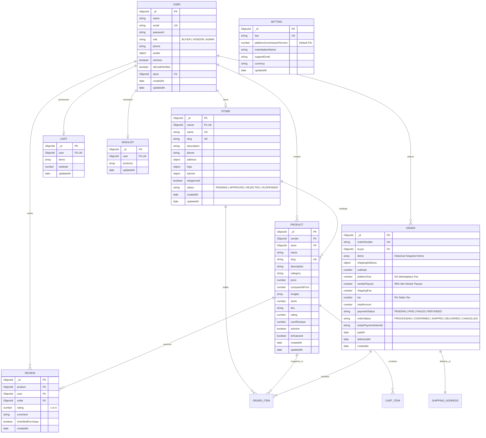

# Artisan's Corner — Database Schema & Architecture

This document provides a comprehensive specification of the MongoDB database schema, relationships, and data dictionary for the **Artisan's Corner** Multi-Vendor Marketplace.

---

## 1. Entity-Relationship (ER) Diagram

---

## 2. Detailed Data Dictionary

### 2.1 User Collection (`users`)
| Field | Type | Required | Constraints | Description |
| :--- | :--- | :--- | :--- | :--- |
| `_id` | ObjectId | Yes | Auto PK | Unique identifier |
| `name` | String | Yes | Trim, Max 50 | User full name |
| `email` | String | Yes | Unique, Lowercase | User email for authentication |
| `password` | String | Yes | Min 6 (hashed) | Bcrypt salted & hashed password |
| `avatar` | Object | No | `{ url, publicId }` | Profile picture |
| `phone` | String | No | Trim | Contact phone number |
| `role` | String | Yes | `BUYER`, `VENDOR`, `ADMIN` | Role-based access control tier |
| `isActive` | Boolean | Yes | Default: `true` | Account active toggle |
| `isEmailVerified` | Boolean | Yes | Default: `true` | Email confirmation flag |
| `store` | ObjectId | No | Ref: `Store` | Associated store if vendor |
| `createdAt` | Date | Yes | Auto timestamp | Account creation date |
| `updatedAt` | Date | Yes | Auto timestamp | Last account modification |

### 2.2 Store Collection (`stores`)
| Field | Type | Required | Constraints | Description |
| :--- | :--- | :--- | :--- | :--- |
| `_id` | ObjectId | Yes | Auto PK | Unique identifier |
| `owner` | ObjectId | Yes | Unique, Ref: `User` | User who created the store |
| `name` | String | Yes | Unique, Max 100 | Artisan store / studio brand |
| `slug` | String | Yes | Unique, URL-safe | URL slug for public store page |
| `logo` | Object | No | `{ url, publicId }` | Studio icon |
| `banner` | Object | No | `{ url, publicId }` | Studio top cover banner |
| `description` | String | Yes | Max 1000 | Artisan story, craft materials & bio |
| `phone` | String | Yes | Phone format | Direct vendor contact |
| `address` | Object | No | `{ street, city, state, postalCode, country }` | Studio physical workshop location |
| `isApproved` | Boolean | Yes | Default: `false` | Admin approval state |
| `status` | String | Yes | `PENDING`, `APPROVED`, `REJECTED`, `SUSPENDED` | Application review status |

### 2.3 Product Collection (`products`)
| Field | Type | Required | Constraints | Description |
| :--- | :--- | :--- | :--- | :--- |
| `_id` | ObjectId | Yes | Auto PK | Unique identifier |
| `vendor` | ObjectId | Yes | Ref: `User` | Maker user reference |
| `store` | ObjectId | Yes | Ref: `Store` | Studio reference |
| `name` | String | Yes | Max 150 | Product title |
| `slug` | String | Yes | Unique, URL-safe | URL slug for product detail view |
| `description` | String | Yes | Max 3000 | Detailed craft story & technique |
| `category` | String | Yes | Categorical Enum | e.g. `Ceramics & Pottery`, `Leather Goods` |
| `price` | Number | Yes | Min: 0.01 | Current item selling price (USD) |
| `compareAtPrice` | Number | No | `>= price` | Strikethrough original price |
| `images` | Array | Yes | `[{ url, publicId }]` | High-res item photography |
| `stock` | Number | Yes | Min: 0, Integer | Available warehouse inventory |
| `sku` | String | No | Trim | Stock Keeping Unit |
| `rating` | Number | Yes | 0 to 5, Default 0 | Average star rating |
| `numReviews` | Number | Yes | Min: 0, Default 0 | Total verified review count |
| `isActive` | Boolean | Yes | Default: `true` | Visibility flag |
| `isFeatured` | Boolean | Yes | Default: `false` | Spotlight flag on homepage |

### 2.4 Order Collection (`orders`)
| Field | Type | Required | Constraints | Description |
| :--- | :--- | :--- | :--- | :--- |
| `_id` | ObjectId | Yes | Auto PK | Unique identifier |
| `orderNumber` | String | Yes | Unique, Indexed | Human-readable order code (e.g. `ORD-xxx`) |
| `buyer` | ObjectId | Yes | Ref: `User` | Buyer user reference |
| `items` | Array | Yes | Item snapshots | Immutable snapshot of purchased items |
| `shippingAddress` | Object | Yes | Full address structure | Delivery destination |
| `subtotal` | Number | Yes | Server calculated | Items gross subtotal |
| `platformFee` | Number | Yes | Server calculated (5%) | Marketplace revenue |
| `vendorPayout` | Number | Yes | Server calculated (95%) | Net vendor earnings |
| `shippingFee` | Number | Yes | Default: 0 | Shipping cost |
| `tax` | Number | Yes | Server calculated (5%) | Estimated sales tax |
| `totalAmount` | Number | Yes | Server calculated | Final amount charged to Stripe |
| `paymentStatus` | String | Yes | `PENDING`, `PAID`, `FAILED`, `REFUNDED` | Stripe payment state |
| `orderStatus` | String | Yes | `PROCESSING`, `CONFIRMED`, `SHIPPED`, `DELIVERED`, `CANCELLED` | Delivery fulfillment state |
| `stripePaymentIntentId`| String | No | Stripe Ref | PaymentIntent identifier |

### 2.5 Review Collection (`reviews`)
| Field | Type | Required | Constraints | Description |
| :--- | :--- | :--- | :--- | :--- |
| `_id` | ObjectId | Yes | Auto PK | Unique identifier |
| `product` | ObjectId | Yes | Ref: `Product` | Reviewed craft |
| `user` | ObjectId | Yes | Ref: `User` | Reviewer |
| `order` | ObjectId | Yes | Ref: `Order` | Order proving purchase |
| `rating` | Number | Yes | 1 to 5 | Star score |
| `comment` | String | Yes | Max 1000 | Verified feedback comment |
| `isVerifiedPurchase` | Boolean | Yes | Default: `true` | Verified badge indicator |

---

## 3. Database Indexes

| Collection | Indexed Fields | Type | Purpose |
| :--- | :--- | :--- | :--- |
| `users` | `{ email: 1 }` | Unique | Fast credential lookups and uniqueness |
| `stores` | `{ slug: 1 }` | Unique | Fast slug-based storefront routing |
| `stores` | `{ owner: 1 }` | Unique | 1:1 user to store ownership check |
| `products` | `{ slug: 1 }` | Unique | Fast product URL lookups |
| `products` | `{ name: "text", description: "text" }` | Text | Full-text marketplace search |
| `products` | `{ vendor: 1, createdAt: -1 }` | Compound | Fast vendor catalog queries |
| `products` | `{ category: 1, price: 1 }` | Compound | Filtered catalog performance |
| `orders` | `{ orderNumber: 1 }` | Unique | Instant order lookups |
| `orders` | `{ buyer: 1, createdAt: -1 }` | Compound | Fast buyer history retrieval |
| `orders` | `{ "items.vendor": 1, createdAt: -1 }` | Compound | Fast vendor order isolation queries |
| `reviews` | `{ product: 1, user: 1, order: 1 }` | Unique Compound | Strict 1 review per purchase rule |
